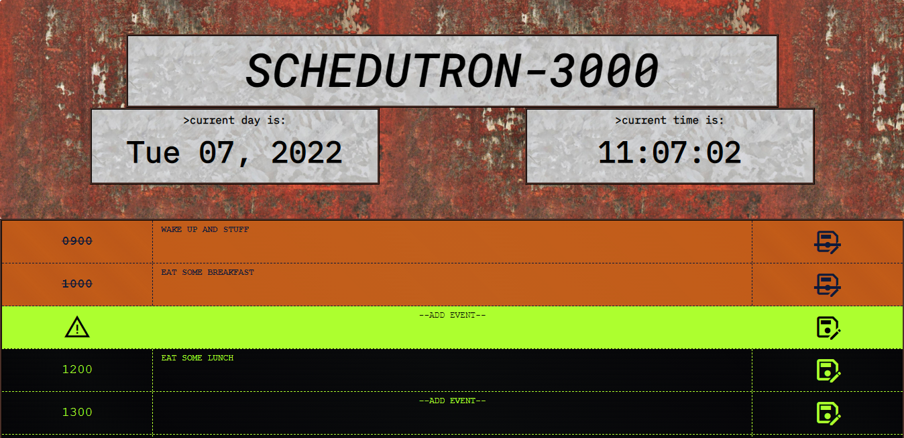

## WELCOME:
This is the README.md for the Challenge Five "Work Day Scheduler" for the UT Coding Bootcamp.

I started with the provided souce code, which was only HTML and CSS, and went from there.

## CRITERIA: 

```
AS AN employee with a busy schedule
I WANT to add important events to a daily planner
SO THAT I can manage my time effectively
```

```
GIVEN I am using a daily planner to create a schedule
WHEN I open the planner
THEN the current day is displayed at the top of the calendar
WHEN I scroll down
THEN I am presented with time blocks for standard business hours
WHEN I view the time blocks for that day
THEN each time block is color-coded to indicate whether it is in the past, present, or future
WHEN I click into a time block
THEN I can enter an event
WHEN I click the save button for that time block
THEN the text for that event is saved in local storage
WHEN I refresh the page
THEN the saved events persist
```

## HOW TO:

Follow the link below to open SCHEDUTRON-3000

Time blocks that are in the past display as a <span style="color:rgb(194, 92, 25)">burnt-orange rust color.</span> These blocks of time will be uneditable- they're in past! Get to the present!

Present and future blocks of time are editable. They will be a black field with <span style="color:greenyellow; background:black">bright green text on top.</span> The current present hour will have it's time field as an alert triangle, pulsing between black and green!

Record whatever events you have at that event hour and hit that save floppy in the right hand column. Now your event will be present whenever you return to the webpage.

## SCREENSHOT:


## VISIT:
Click here to use <a href="https://lawhornmatt.github.io/Ch5_DayScheduler/" target="_blank">SCHEDUTRON-3000</a>

## CREDIT:
Matthew Lawhorn, July 2022